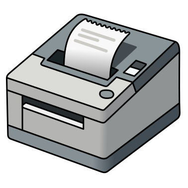
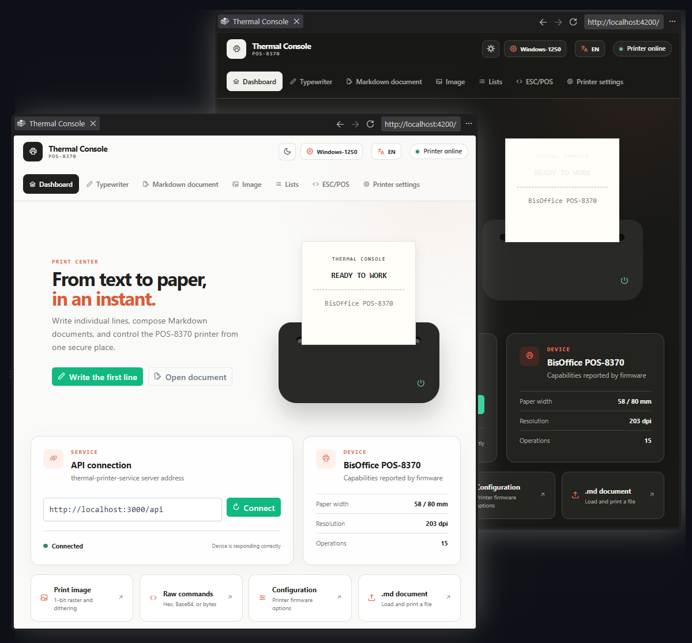
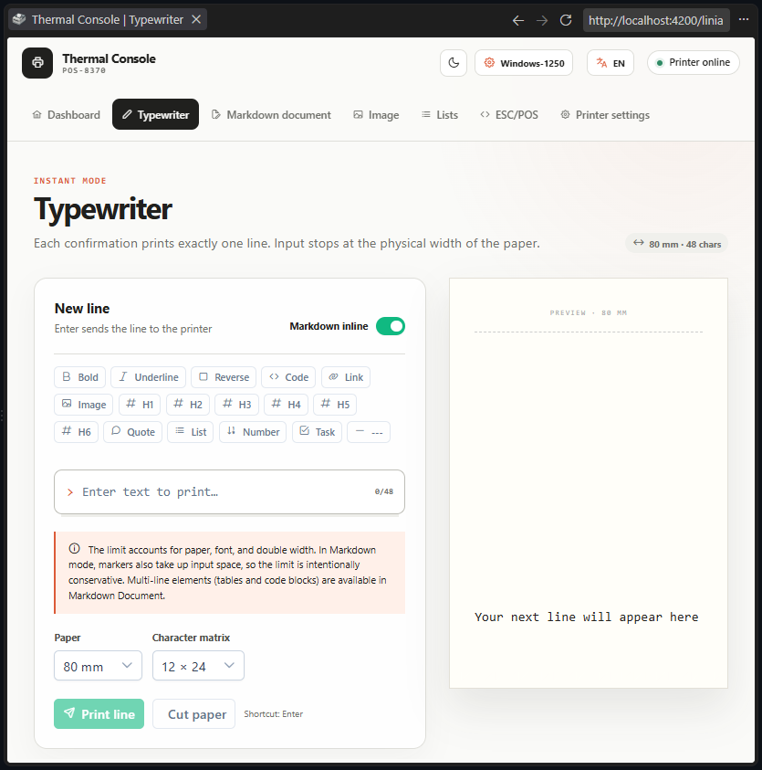
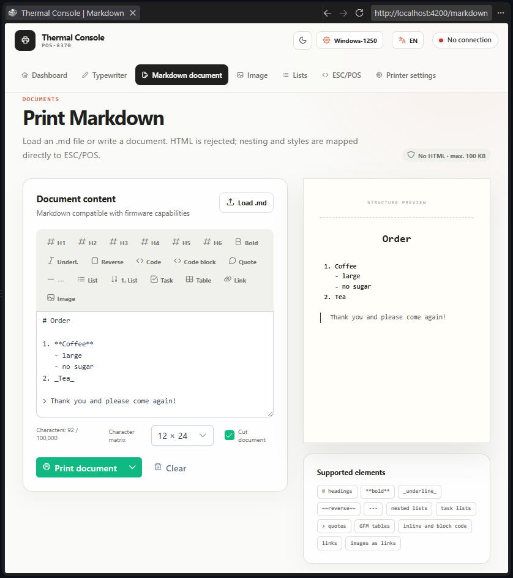
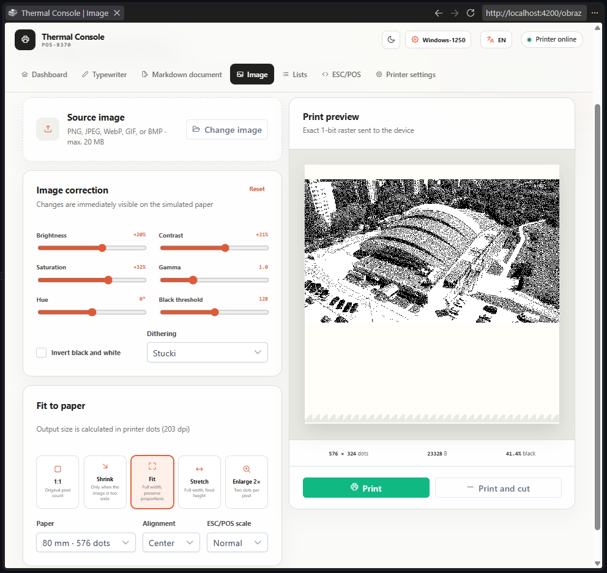
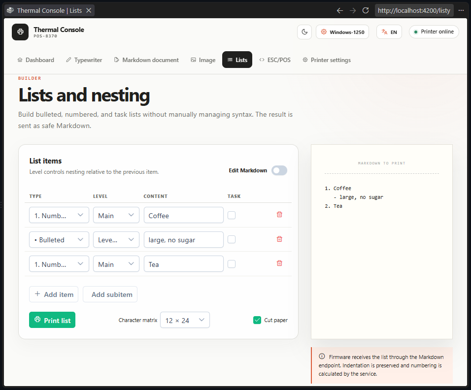
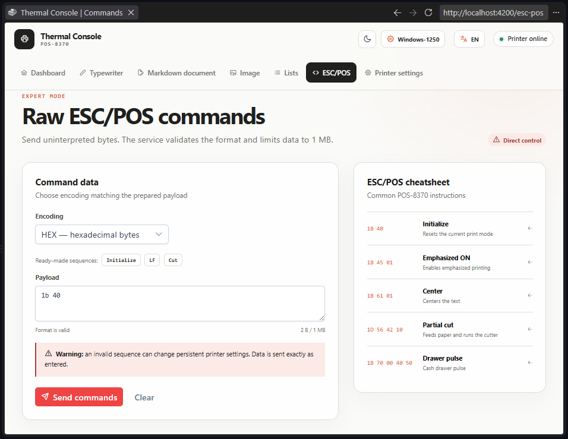
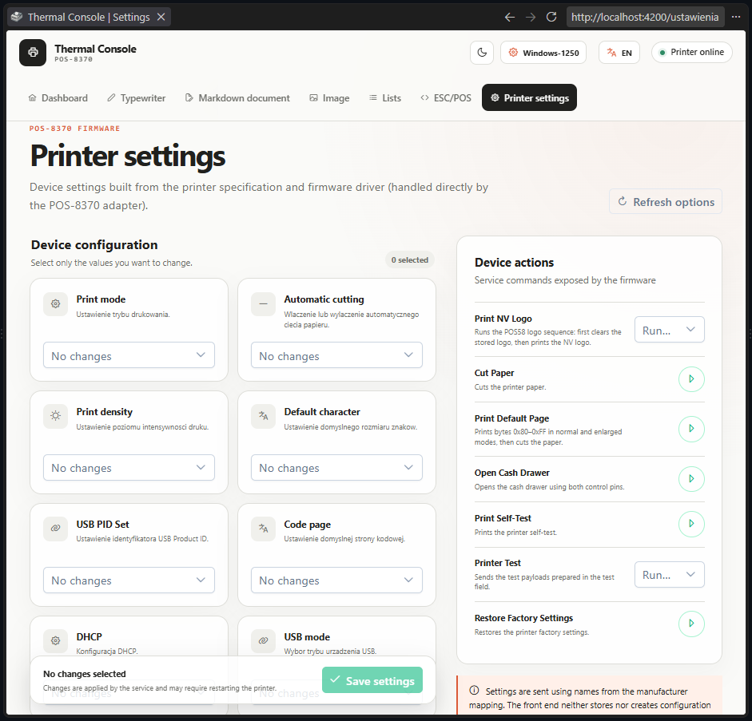

# ESC POS Multipack

<div align="center">
  
</div>

**Thermal Console** is a web app for the BisOffice POS-8370 thermal receipt
printer. It turns a browser into a print terminal: type a line, write a
Markdown document, print an image, build a list, or send raw ESC/POS bytes —
all through a REST API that drives the printer over LAN or USB.

The repository is a monorepo with three layers:

- an Angular client (Thermal Console),
- a NestJS REST service that talks to the printer,
- a model-independent adapter library plus a BisOffice POS-8370 driver built
  from a manually verified command reference.

## Features

<div align="center">


The dashboard shows connection status, printer capabilities, and shortcuts to
common print modes. Light and dark themes and English/Polish are switchable
from the top bar.

**Typewriter** — send one line at a time, with inline Markdown formatting and a live paper-width preview.



**Markdown document** — write or load an `.md` file; headings, lists, tables, quotes, and links map directly to ESC/POS. HTML is rejected.



**Image** — upload a photo, adjust brightness/contrast/dithering, and print it as a 1-bit raster sized to the paper.



**Lists** — build nested bulleted, numbered, or task lists without hand-writing Markdown.



**ESC/POS** — expert mode for sending raw hex/base64/byte commands, with a cheatsheet of common instructions.



**Printer settings** — read and write POS-8370 firmware configuration and trigger device actions (self-test, factory reset, cash drawer, ...).


</div>

## Quick start

```powershell
pnpm install
pnpm dev:thermal-printer-service          # API on http://localhost:3000/api
pnpm dev:thermal-printer-simple-client    # client on http://localhost:4200
```

Run each command in its own terminal. Application-specific configuration
(environment variables, endpoints, encodings) is documented in the READMEs
under `apps/`.

## Repository layout

| Path                                                                                 | Contents                                                                                                 |
| ------------------------------------------------------------------------------------ | -------------------------------------------------------------------------------------------------------- |
| [`apps/thermal-printer-service`](apps/thermal-printer-service/README.md)             | NestJS REST API: printer configuration, printing, Swagger docs.                                          |
| [`apps/thermal-printer-simple-client`](apps/thermal-printer-simple-client/README.md) | Angular client (Thermal Console).                                                                        |
| [`packages/printer-adapter`](packages/printer-adapter/README.md)                     | Model-independent printer adapter contracts.                                                             |
| [`packages/pos-8370-adapter`](packages/pos-8370-adapter/README.md)                   | BisOffice POS-8370 driver built on those contracts.                                                      |
| [`docs/Bisoffice_POS-8370_docs`](docs/Bisoffice_POS-8370_docs)                       | Device configuration mapping and the manually verified ESC/POS command reference for this printer model. |
| [`.github/pipeline_docs`](.github/pipeline_docs/README.md)                           | CI/CD pipeline documentation (portable to other repositories).                                           |

## Deployment

Production runtime settings are versioned in `deploy/config.env`. The current
endpoints are:

- client: `http://192.168.1.160:10100`
- API: `http://192.168.1.160:10120/api`
- Swagger UI: `http://192.168.1.160:10120/docs`

The CI/CD pipeline that builds and deploys the containers is documented in
[`.github/pipeline_docs`](.github/pipeline_docs/README.md).

## Development

```powershell
pnpm build
pnpm test
pnpm typecheck
pnpm test:ci
```
