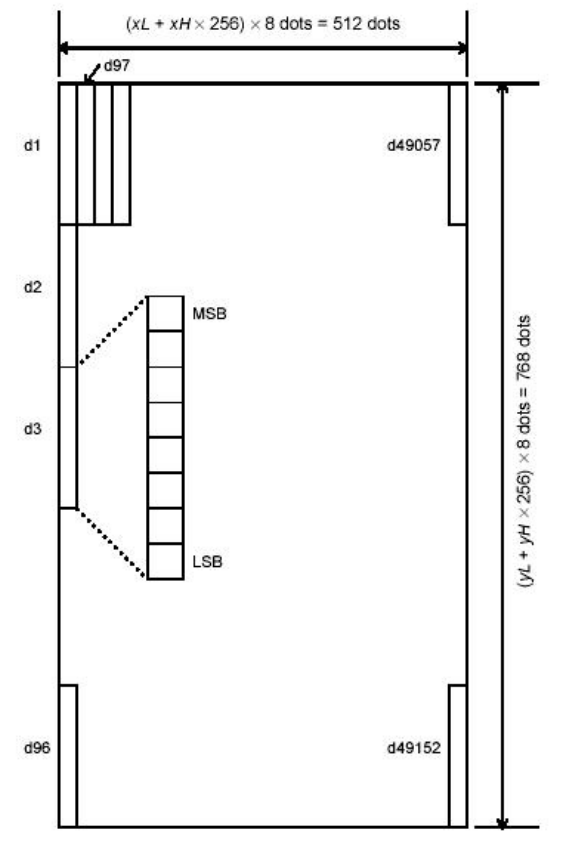

<!-- page 17 -->

# `FSqn[xLxHyL yHd1...dk]1 ... [xLxHyLyHd1...dk]n`

**Name**: Define NV bit image

**Format**

| Encoding | Value                                                    |
| -------- | -------------------------------------------------------- |
| Ascii    | `FS q n [xL xH yL yHd1...dk]1...[xL xH yL yHd1...dk]n`   |
| Hex      | `1C 71n [xL xH yL yHd1...dk]1...[xL xH yL yHd1...dk]n`   |
| Decimal  | `28 113n [xL xH yL yHd1...dk]1...[xL xH yL yH d1...dk]n` |

**Range**:

`1 ≤ n ≤ 255`
`0 ≤ xL ≤ 255`
`0 ≤ xH ≤ 3, when 1 ≤ (xL+ xH × 256) ≤ 1023`
`0 ≤ yL ≤ 255`
`0 ≤ yH ≤ 1, when 1 ≤ (yL+ yH × 256) ≤ 288`
`0 ≤ d ≤ 255`
`k=(xL + xH × 256) × (yL + yH × 256) × 8`

Total defined data area = 192K bytes

**Description**:

Define the NV bit image specified by `n`.

- `n` specifies the number of the defined NV bit image.
- `xL`, `xH` specifies `(xL + xH * 256) * 8` dots in bit image you are defining.
- `yL`, `yH` specifies `(yL + yH * 256) * 8` dots in imageyou are defining.

**Note**:

- Frequently write command may be damaged NV memory. Therefore, it is recommended to perform no more than 10 times a day, write the NV memory.

- After put an image into NV memory process, the printer performs a hardware reset the user-defined characters, download bitmap and macros should be defined after the completion of the command. Printer Clear receive and print buffer and resets when power efficient model. At this time switch is DIP check again. (Does not support hardware reset interface)

- This command cancels all been defined with this command NV bitmap.

- From the beginning of the processing of this command till the finish of hardware reset,mechanical operations (including initializing the position of the printer head when the cover is open, paper feeding by using the FEED button, etc.) cannot be performed.

- During processing this command, the printer is in BUSY when writing the data to the NV user memory and stops receiving data. Therefore it is prohibitted to transmit the data including the real-time commands during the execution of this command。

- NV bit image means a bit image which is defined in a non-volatile memory by `FS q` and printed by `FS p`.

- In standard mode, this command is effective only when processed at the beginning of the line.

- This command is effective when 7 bytes `<FS yH>` is processed as a normal value.

- When the amount of data exceeds the capacity left in the range defined by xL, xH, yL,yH, the printer processes xL, xH, yL, yH out of the defined range.

- In the first group of NV bit images, when any of the parameters xL, xH, yL, yH is out of the definition range, this command is disabled.

- In groups of NV bit images other than the first one, when the printer processes xL, xH, yL,yH out of the defined range, it stops processing this command and starts writing into the NV images. At this time, NV bit images that haven't been defined are disabled(undefined), but any NV bit images before that are enabled.

- The `d` indicates the definition data. In data `(d)` a 1 bit specifies a dot to be printed and a 0 bit specifies a dot not to be printed.

- This command defines `n` as the number of a NV bit image. Numbers rise in order from NV bit image `01H`. Therefore, the first data group `[xL xH yL yH d1...dk]` is NV bit image `01H`,and the last data group `[xL xH yL yH d1...dk]` is NV bit image `n`. The total agrees with the number of NV bit images specified by command `FS p`.

- A definition data of a NV bit image consists of `[xL xH yL yH d1...dk]`. Therefore, when only one NV bit image is defined `n=1`, the printer processes a data group `[xL xH yL yH d1...dk]` once. The printer uses `([data: (xL + xH * 256) * (yL + yH * 256) * 8] + [header :4])` bytes of NV memory.

- The definition area in this printer is a maximum of `192K` bytes. This commandcan define several NV bit images, but cannot define a bit image data whose total capacity `[bit_image_data + header]` exceeds 192K bytes.

- Even setting the `ASB`, during the processing of the command the printer is not transmitted ASB status or execution status detection.

- When this command is received during macro definition, the printer ends macro definition, and begins performing this command.

- Once a NV bit image is defined, it is not erased by performing `ESC @`, reset, and power off.

- This command performs only definition of a NV bit image and does not perform printing. Printing of the NV bit image is performed by the `FS p` command.

**Reference**: `FS p`

**Example**: When xL = 64, xH = 0, yL = 96, yH = 0

