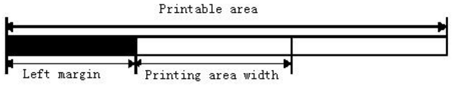

<!-- Source PDF page 21 -->

## `GSLnLnH`

**Name**: Set left margin

**Format**

| Encoding    | Value        |
| ----------- | ------------ |
| ASCII       | `GS L nLnH`  |
| Hexadecimal | `1D 4C nLnH` |
| Decimal     | `29 76 nLnH` |

**Range**:
`0 ≤ nL ≤ 255`
`0 ≤ nH ≤ 255`

**Description**:

- Sets the left margin using `nL` and `nH`.

- The left margin is set to `[(nL + nH × 256) × 0.125mm]`

**Note**:

- This command is effective only processed at the beginning of the line in standard mode.

- If the setting exceeds the printable area, the maximum value of the printable area is used.

**Defaults**: `nL=0`,`nH=0`

**Reference**: `GS W`
