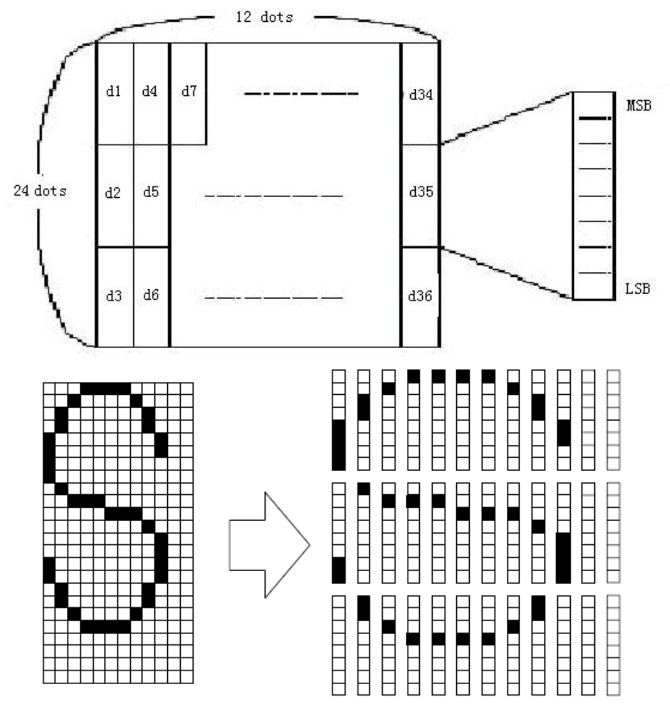
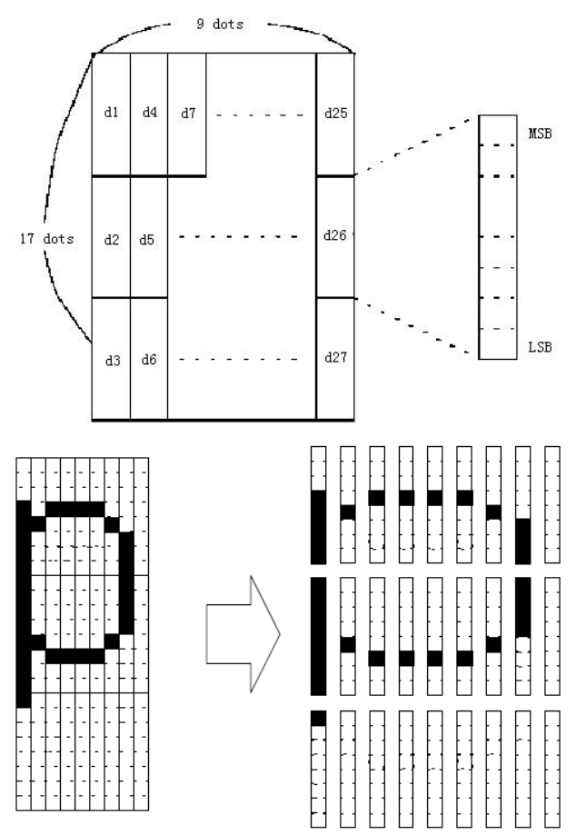

<!-- page 5 -->

# `ESC&yc1c2[x1d1...d(y×x1)].. .[xkd1...d(y×xk)]`

- × is 'times' character
- x i 'x' variable

**Name**: Define user-defined characters

**Format**

| Encoding | Value                                              |
| -------- | -------------------------------------------------- |
| Ascii    | `ESC & y c1 c2[x1d1...d(y×x1)]...[xkd1...d(y×xk)]` |
| Hex      | `1B 26 yc1 c2[x1d1...d(y×x1)]...[xkd1...d(y×xk)]`  |
| Decimal  | `27 38 yc1 c2[x1d1...d(y×x1)]...[xkd1...d(y×xk)]`  |

**Range**:

`y=3`
`32 ≤ c1 ≤ c2 ≤ 126`
`0 ≤ x ≤ 12(12×24)`
`0 ≤ x ≤ 9(9×17)`
`0 ≤ d1...d(y×xk) ≤ 255`

**Description**:

- Defines user-defined characters.

- `y` specifies the number of bytes in the vertical direction.

- `c1` specifies the beginning character code for the definition, and `c2` specifies the final code

- `x` specifies the number of dots in the horizontal direction.

**Note**:

- The allowable character code range is from ASCII code `<20>H` to `<7E>H` (95 characters).

- It is possible to define multiple characters for consecutive character codes. If only one character is desired, use `c1 = c2`.

- `d` is the dot data for the characters. The dot pattern is in the horizontal direction`from the left side. Any remaining dots on the right side are blank.

- The data to define a user-defined character is `(y×x)` bytes.

- Set a corresponding bit to `1` to print a dot or `0` to not print a dot.

- This command can define different user-defined character patterns by each fonts. To select a font, use `ESC !`

- A user-defined character and a downloaded bit image cannot be defined simultaneously. When this command is executed, the downloaded bit image is cleared.

- The user-defined character definition is cleared when:
  1. `ESC @` is executed.
  2. `ESC ?` is executed.
  3. `ESC?` is executed
  4. The printer is reset or the power is turned off.

- When the user-defined characters are defined in font `B` `(9 × 17)`, only the most significant bit of the 3rd byte of data in vertical direction is effective.

**Defaults**: The internal character set

**Reference**: `ESC%`,`ESC?`

**Example**:

When font `A(12*24)` is selected.



```
d1=<0F>Hd4=<30>Hd7=<40>H....
d2=<03>Hd5=<80>Hd8=<40>H....
d3=<00>Hd6=<00>Hd9=<20>H....
```

---

When font `B(9*17)` is selected.



```
d1=<1F>Hd4=<08>Hd7=<10>H...
d2=<FF>Hd5=<08>Hd8=<04>H...
d3=<80>Hd6=<00>Hd9=<00>H...
```
