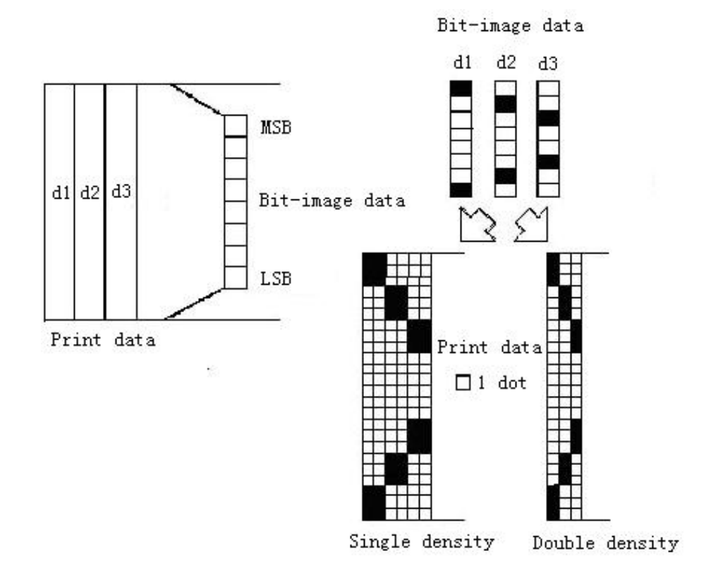
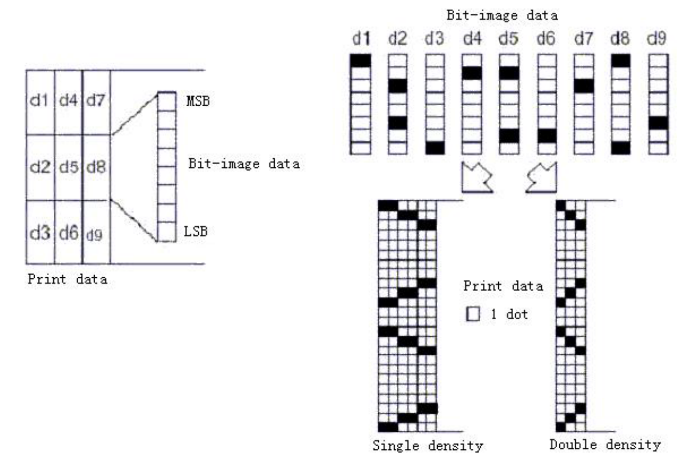

<!-- page 7 -->

## `ESC*mnLnHd1...dk`

**Name**: Select bit-image mode

**Format**

| Encoding | Value                    |
| -------- | ------------------------ |
| Ascii    | `ESC ∗ m nL nH d1...dk`  |
| Hex      | `1B 2A m nL nH d1...dk`  |
| Decimal  | `127 42 m nL nH d1...dk` |

**Range**:

`m=0, 1, 32,33`
`0 ≤ nL ≤ 255`
`0 ≤ nH ≤ 3`
`0 ≤ d ≤ 255`

**Description**:

Selects a bit-image mode using `m` for the number of dots specified by `nL` and `nH`, as follows:

| m   | Mode                  | Vertical Direction — Number of Dots | Vertical Direction — DotDensity | Horizontal Direction — DotDensity | Horizontal Direction — Number of Data(K) |
| --- | --------------------- | ----------------------------------- | ------------------------------- | --------------------------------- | ---------------------------------------- |
| 0   | 8-dot single-density  | 8                                   | 67.7dpi                         | 101.6dpi                          | nL + nH ∗ 256                            |
| 1   | 8-dot double-density  | 8                                   | 67.7dpi                         | 203.2dpi                          | nL + nH ∗ 256                            |
| 32  | 24-dot single-density | 24                                  | 203.2dpi                        | 101.6dpi                          | (nL + nH ∗ 256) ∗ 3                      |
| 33  | 24-dot double-density | 24                                  | 203.2dpi                        | 203.2dpi                          | (nL + nH ∗ 256) ∗ 3                      |

dpi:Print dots per 25.4 mm (1 inch)

**Note**:

- If the values of `m` is out of the specified range, `nL` and data following are processed as normal data. `nL` and `nH` represents the horizontal upper figure points, calculated by `nL + nH256 points`.

- If the bit-image data input exceeds the number of dots to be printed on a line,the excess data is ignored.

- `d` indicates the bit-image data. Set a corresponding bit to `1` to print a dot or to `0` to not print a dot.

- If the width of the printing area set by `GS L` and `GS W` less than the width required by the data sent with the `ESC *` command, the following will be performed on the line in question (but the printing cannot exceed the maximum printable area):
  1. The width of the printing area is extended to the right to accommodate the amount of data.
  2. If step `1` does not provide sufficient width for the data, the left margin is reduced to accommodate the data. For each bit in the single density mode `(m = 0, 32)` of the data, the printer prints two points. For double density mode `(m = 1,33)` of each bit of data, the printer prints a dot . When calculating the amount of data that can be printed on one line, they must be considered.

- After printing a bit image, the printer returns to normal data processing mode.

- This command is not affected by print modes (emphasized, double-strike, underline, character size or white/black reverse printing), except upside-down printing mode.

- The relationship between the image data and the dots to be printed is as follows:
  - When 8-dot bit image is selected:

    

  - When 24-dot bit image is selected:

    
